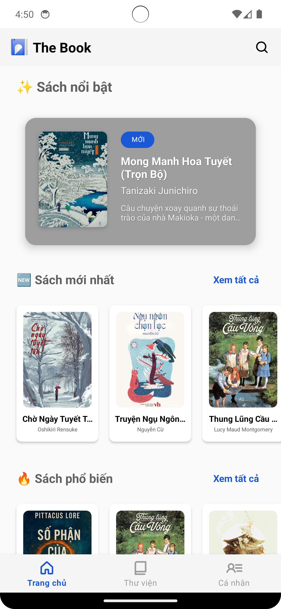
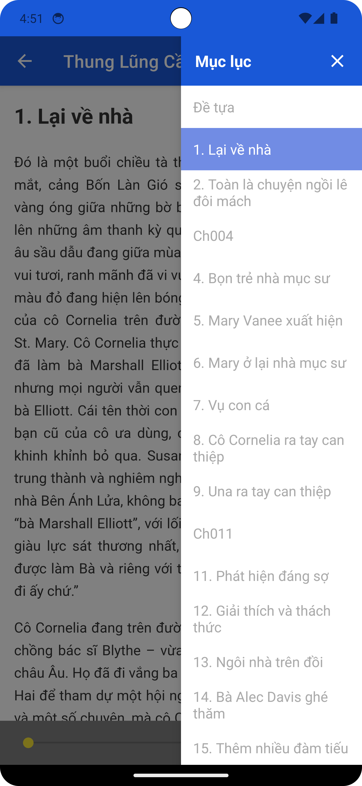
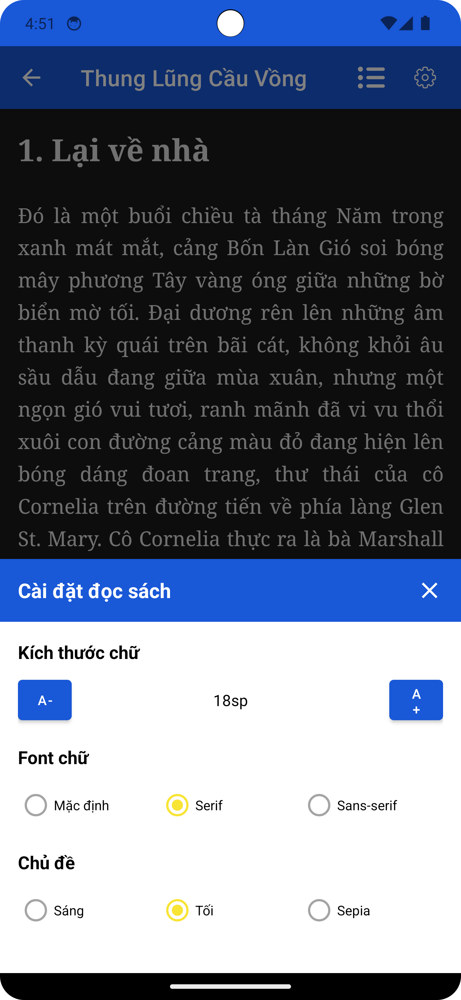
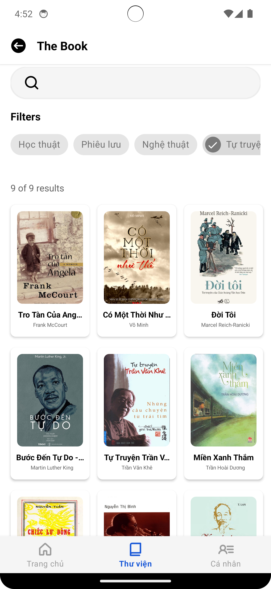

# The Book 📚

Một ứng dụng đọc sách về định dạng **EPUB**, được xây dựng bằng **Kotlin** và sử dụng **Firebase Realtime Database** để quản lý danh mục sách thông qua các đường dẫn (URL) lấy từ bên thứ ba.

-----

## Screenshots

| Trang chủ | Chi tiết sách | Màn hình đọc sách | Màn hình đọc sách | Tìm kiếm | Thư viện cá nhân |
| :---: | :---: | :---: | :---: | :---: | :---: |
|  |  |  |  |  |  |
-----

## ✨ Các tính năng chính

  * **Quản lý danh mục sách:** Lưu trữ và hiển thị danh sách sách cá nhân, được đồng bộ hóa tức thì nhờ **Firebase Realtime Database**.
  * **Thêm sách bằng URL:** Cho phép người dùng dễ dàng thêm sách EPUB vào thư viện bằng cách cung cấp đường dẫn (URL) trực tiếp từ các nguồn lưu trữ bên ngoài (Google Drive).
  * **Trải nghiệm đọc EPUB chất lượng cao:** Sử dụng thư viện chuyên dụng để phân tích và hiển thị nội dung EPUB, bao gồm hình ảnh, mục lục, và các định dạng chữ.
  * **Chức năng cơ bản của trình đọc:** Hỗ trợ chuyển trang mượt mà, điều chỉnh kích thước chữ, và chế độ đọc (sáng/tối).
-----

## 🛠 Công nghệ & Thư viện

Dự án này được xây dựng hoàn toàn bằng **Kotlin** và sử dụng kiến trúc **MVVM (Model-View-ViewModel)**.

### Core Components

  * **[Kotlin](https://kotlinlang.org/)**: Ngôn ngữ lập trình chính cho Android.
  * **[Coroutines](https://kotlinlang.org/docs/coroutines-overview.html)**: Xử lý các tác vụ bất đồng bộ, đặc biệt là truy vấn database và tải file EPUB.
  * **[Firebase Realtime Database](https://firebase.google.com/docs/database)**:
      * **Quản lý Metadata sách:** Lưu trữ **đường dẫn (URL)** của file EPUB, tiêu đề sách, tác giả và các thông tin cơ bản khác.
      * **Đồng bộ hóa tức thì:** Tự động cập nhật danh sách sách cho người dùng.

### EPUB

  * **[epublib](https://github.com/psiegman/epublib)**: Thư viện chính để xử lý cú pháp, tải và hiển thị nội dung EPUB.

### UI & Presentation

* **ViewModel**: Quản lý trạng thái và dữ liệu của UI.
* **LiveData/StateFlow**: Cập nhật danh sách sách từ Firebase lên UI.
* **View Binding**: Liên kết an toàn các thành phần UI.
* **Navigation Component**: Quản lý việc chuyển đổi giữa các màn hình.
* **[Glide](https://github.com/bumptech/glide)**: Tải và hiển thị ảnh bìa sách.

-----

## 💾 Firebase Realtime Database

Dữ liệu trên Firebase chỉ bao gồm các tham chiếu:

```json
{
  "books": {
    "_id": {
      "title": "Cầu Thang Gào Thét",
      "author": "Jonathan Stroud", 
      "description": "Suốt hơn năm mươi năm Luân đôn đã gồng mình trước một điều đáng sợ: các vụ ma ám và hiện hồn liên tục xảy ra...",
      "publishedYear": 2013,
      "language": "English",
      "pageCount": 36,
      "bookFileUrl": "https://docs.google.com/uc?...",.
      "coverImageUrl": "https://cdn1.fahasa.com/media/catalog/product/2/3/2317e14a355ca7ec08140e45bd313625.jpg",
      "free": true,
      "price": 0,
      "averageRating": 0,
      "totalRatings": 0,
      "stability": 0,
      "uploadDate": 1750223537440
    }
  }
}
```

**Lưu ý:** File `.epub` thực tế **không** được lưu trữ trong Firebase Storage.

-----